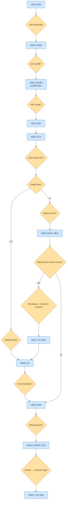

# scrna-seq-clustering

A [Claude Code skill](https://docs.claude.com/en/docs/claude-code/skills) that scaffolds a validated, config-driven **Seurat** clustering pipeline for a **new** scRNA-seq or Perturb-seq/CRISPR-screen dataset — one step at a time, confirming with you before it runs anything.

This skill interviews you for the study-specific values (lanes, h5 paths, marker genes, QC thresholds as they come up), writes each step's `process.R`/`plot.R`/`slurm.sh`, shows you the exact command it's about to run and waits for confirmation, then runs it itself and stops — waiting for you to confirm the output looks right before writing the next step.

## Requirements

R 4.4 + Seurat 5.5 stack (see `templates/environment.yml` for the full pinned list: qs2, scDblFinder, ComplexUpset, etc.), `conda`/`mamba` available, and CellRanger-output `.h5` files per lane. A SLURM cluster is optional — steps can instead run interactively via `conda run`.

## How to install

```bash
git clone https://github.com/huangfulab/scrna-seq-clustering.git ~/.claude/skills/scrna-seq-clustering
```

Claude Code picks up any skill under `.claude/skills/` automatically — no further registration needed.

## Example prompt

In a Claude Code session in your project, just describe the dataset, e.g.:

> I have a new Perturb-seq experiment, 4 lanes, CellRanger h5 files at `/data/mystudy/h5/{lane}.h5`. Can you get me set up?

The skill will pick a profile, ask where the new run should live, walk you through the conda environment, collect `config.yaml`, and then scaffold `step1` — showing you the command it's about to run, running it itself once you confirm, and waiting for you to confirm the output looks right before scaffolding step2.

## Pipeline overview


| Step | What it does |
|---|---|
| `step1_load` | Loads each lane's CellRanger `.h5`, sweeps UMI thresholds 1–10 to help pick where guide detection stabilizes |
| `step2_assign` | Applies the confirmed UMI threshold, computes per-cell guide identity, MOI, and QC metrics (%mt, %ribo) |
| `step3_doublet` | Flags likely doublets with `scDblFinder`, helps pick MOI cutoffs |
| `step4_filter` | Applies all QC/MOI/doublet filters, merges lanes into one object |
| `step5_PCA` | Normalizes, finds variable genes, scores cell cycle, runs PCA — pick how many PCs to keep |
| `step6_batch_effect` | Clusters across a resolution sweep, checks for a batch-driven or low-quality cluster to remove |
| `step7_rm_badcl` | Drops the flagged cluster (skipped entirely if none was found) |
| `step8_res` | Reclusters from scratch on the trimmed data across the same resolution sweep — pick the resolution to commit to |
| `step9_seed` | Reruns clustering at the committed resolution across 8 random seeds — pick the most stable one |
| `step10_cluster_final` | Regenerates the full figure suite for the winning seed + resolution; you map each cluster to a cell type |
| `step11_cell_type` | Applies the cluster → cell-type map and relabels every figure by cell type — end of pipeline |

(`plain` profile: same idea, one fewer step — `step1_load_qc` merges loading and QC into one, no guide/MOI steps; see `references/pipeline-plain.md` for its own 10-step breakdown.)

## License

MIT — see `LICENSE`.
