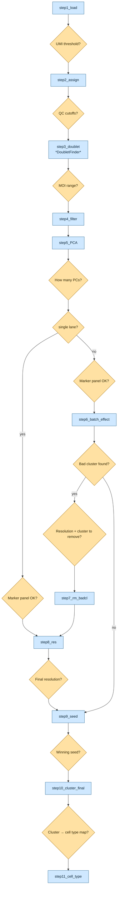

# scrna-seq-clustering-pipeline

A [Claude Code skill](https://docs.claude.com/en/docs/claude-code/skills) that scaffolds a validated, config-driven **Seurat** clustering pipeline for a **new** scRNA-seq or Perturb-seq/CRISPR-screen dataset — one step at a time, never running anything itself.

Instead of writing 10-11 R scripts and a SLURM job for each new dataset from scratch, this skill interviews you for the study-specific values (lanes, h5 paths, marker genes, QC thresholds as they come up), writes each step's `process.R`/`plot.R`/`slurm.sh`, hands you the exact command to run, and stops — waiting for you to confirm the output looks right before writing the next step.

## Why one step at a time?

Three rules the skill follows strictly (see `SKILL.md` for the full rationale):

1. **Never executes anything.** It only writes files and gives you the `sbatch`/`conda run` command — you stay in control of what actually runs on the cluster.
2. **Hard stop after every step.** Even mechanical steps with nothing new to decide still require you to confirm before the next step gets scaffolded.
3. **Explains checkpoints in plain language.** No "confirm UMI_THRESHOLD" — it explains what the figure shows and what moving the value up/down does, assuming no prior Seurat experience.

## The two profiles

| Profile | Steps | Use when |
|---|---|---|
| `perturbseq` | 11 | Dataset has a CRISPR guide screen (Perturb-seq) — cells were each infected with a guide RNA and you want to know which gene each cell's guide targets |
| `plain` | 10 | Plain scRNA-seq, no guide capture |



Shown as the 11-step perturbseq profile. Blue rectangles are scaffolded steps; amber diamonds are the checkpoint decision made before the next step gets scaffolded. Two shortcuts skip steps entirely: a single-lane run skips straight from `step5_PCA` to `step8_res`, and a run where no cluster looks bad at `step6_batch_effect` skips straight to `step9_seed`. Full per-step spec for both profiles (what each step computes, what each checkpoint figure means, and both shortcuts in detail): `references/pipeline-perturbseq.md` and `references/pipeline-plain.md`.

## Installing

Drop this repo into your project's or user-level `.claude/skills/` directory:

```bash
git clone https://github.com/zzzjjhhh/scrna-seq-clustering-pipeline.git .claude/skills/scrna-seq-clustering-pipeline
```

Claude Code picks up any skill under `.claude/skills/` automatically — no further registration needed.

## Using it

In a Claude Code session in your project, just describe the dataset, e.g.:

> I have a new Perturb-seq experiment, 4 lanes, CellRanger h5 files at `/data/mystudy/h5/{lane}.h5`. Can you get me set up?

The skill will pick a profile, ask where the new run should live, walk you through the conda environment, collect `config.yaml`, and then scaffold `step1` — stopping there for you to run it and report back.

## Repository layout

```
SKILL.md                        # the skill's own instructions (read this first)
references/
  conventions.md                # here()-root / config.yaml / SLURM / conda conventions
  pipeline-perturbseq.md        # full 11-step spec, perturbseq profile
  pipeline-plain.md             # full 10-step spec, plain profile
templates/
  config.yaml.template          # config schema with every key documented
  environment.yml.template      # conda environment definition
  perturbseq/stepN_xxx/         # process.R + plot.R + slurm.sh per step
  plain/stepN_xxx/              # same, for the plain profile
scripts/
  scaffold.R                    # scaffold_init() / scaffold_next_step()
```

## Requirements

R 4.4 + Seurat 5.5 stack (see `templates/environment.yml.template` for the full pinned list: qs2, scDblFinder, ComplexUpset, etc.), a SLURM cluster with `conda`/`mamba` available, and CellRanger-output `.h5` files per lane.

## License

MIT — see `LICENSE`.
