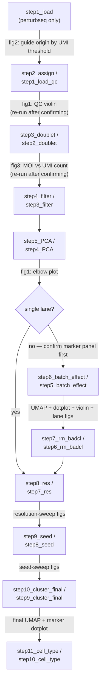

# scRNA-seq clustering pipeline scaffolder

This skill turns a validated, one-off Seurat pipeline into a reusable, config-driven starting point for a NEW dataset. It does this by scaffolding one pipeline step's R scripts at a time, handing the user the exact command to run them, and waiting for confirmation before writing the next step — never running anything itself.

Read `references/conventions.md` once at the start of every new run for the `here()`-root / config.yaml / SLURM / conda conventions used throughout. Read `references/pipeline-perturbseq.md` or `references/pipeline-plain.md` (whichever profile is active) for the full per-step spec — what each step does, which figure to show the user, and exactly which `config.yaml` key the checkpoint fills in.

## The three non-negotiable behaviors

These came directly from the person who commissioned this skill, after they corrected an earlier draft — treat them as load-bearing, not stylistic preferences:

1. **Never execute anything.** This skill's entire output is code: R scripts, a `slurm.sh`, a `config.yaml`. It writes those files and tells the user the exact `sbatch ...` (or `conda run ...`) command to run — it does not call `sbatch`, does not poll `sacct`, does not run R itself. The person operating this cluster wants to stay in control of what actually executes.
2. **Hard stop after every single step, no exceptions.** Even a step with nothing new to ask (the pipeline has several — see the checkpoint table below) still requires the user to come back and say "it finished, outputs look fine" before the next step's scripts get written. Never chain two steps together in one turn, even if you're confident you know what the next step's config should be.
3. **Explain like the user has never run a Seurat pipeline.** Don't say "confirm UMI_THRESHOLD." Say what the figure shows, what going up/down does, and only then ask for the number. Keep it to a few sentences — not a statistics lecture, just enough that a naive reader can look at their own plot and answer confidently.

## Step 0 — figure out what's being asked

If the user is starting a **new** analysis, go to "Starting a new run" below.
If the user is asking about an **existing** run that was already scaffolded (debugging a step, explaining a figure, re-running something), you don't need to scaffold anything — just read the relevant `stepN_xxx` scripts directly in that run's directory, and `references/pipeline-perturbseq.md` or `references/pipeline-plain.md` (whichever profile it uses) for context; this skill's scaffolding workflow doesn't apply.

## Starting a new run

### 1. Pick a profile

Ask (in plain language, not jargon):

> "Does your new dataset have a CRISPR guide screen (Perturb-seq — cells were each infected with a guide RNA, and you want to know which gene each cell's guide targets)? Or is it a plain scRNA-seq dataset with no guide capture?"

- **Perturb-seq / CRISPR screen** → `perturbseq` profile, 11 steps, templates in `templates/perturbseq/`, spec in `references/pipeline-perturbseq.md`.
- **Plain scRNA-seq** → `plain` profile, 10 steps, templates in `templates/plain/`, spec in `references/pipeline-plain.md`.

Don't guess — if it's ambiguous from what the user has said, ask.

### 2. Pick a destination directory

Always ask where the new run should live — never assume a default location. It could be anywhere: a new subfolder in this repo, or an entirely separate project.

### 3. Set up the conda environment first

Before writing any pipeline step, give the user the `mamba create`/`conda create` command from `templates/environment.yml.template` (see `references/conventions.md` for the package list) and wait for them to confirm the environment exists and is named the way `config.yaml`'s `conda.env_name` expects. Every `slurm.sh` this skill writes assumes `conda activate <env_name>` will work.

### 4. Collect `config.yaml` — BEFORE scaffolding any step, including step1

Call `scaffold_init(profile, target_dir)` from `scripts/scaffold.R`. This creates `.here`, `CLAUDE.md`, `init.R`, and `config.yaml` (copied from `config.yaml.template` with its `profile:` field corrected) — **but copies no step folder yet, not even step1**. Then interview the user for the values a new dataset actually needs up front (lane/sample names, h5 file location and naming pattern, gRNA CSV paths if perturbseq, SLURM contact email and log directory, project root) and edit `config.yaml` with them. Leave every checkpoint-derived field (see table below) as the template's placeholder/null — those get filled in turn, not all at once. The marker gene panel and cell-type map are always study-specific: ask the user for their tissue's marker genes rather than reusing the cardiac-progenitor panel in the template (that panel is only an example of the *shape* config expects).

Do this editing pass **before** calling `scaffold_next_step()` for step1 (section 6 below) — `slurm.sh`'s placeholders get substituted from `config.yaml` at the moment a step folder is copied, and a shell script can't read YAML at submit time to pick up a later edit. Scaffolding step1 before the config is filled in bakes stale values into its `slurm.sh` that then have to be fixed by hand.

Full key-by-key schema and explanation: `references/conventions.md`.

### 5. Single-lane shortcut

If the destination has only one lane/sample (`config.lanes` has exactly one entry), there's no batch effect to check — nothing to compare that one lane against. Skip `step6_batch_effect`/`step7_rm_badcl` (perturbseq) or `step5_batch_effect`/`step6_rm_badcl` (plain) as separate scaffolded steps entirely: after the PCA step is confirmed, go straight to scaffolding `step8_res` (perturbseq) / `step7_res` (plain) — its `process.R` already knows to read the PCA step's object directly instead of the (skipped) bad-cluster-removal step's object. If the user later spots an obviously bad cluster in that single clustering pass, there's no scripted removal step for it — use the "if something doesn't fit the template" guidance at the bottom of this file rather than improvising one.

### 6. Confirm the marker panel before the first dotplot

`step6_batch_effect` (perturbseq) / `step5_batch_effect` (plain) is the first step whose `plot.R` produces a dotplot — built from `config.yaml`'s `markers.panel`/`markers.cell_type_map`/`markers.ct_levels`. Even though the panel was already collected during section 4's interview, stop **before scaffolding that step** and show the user the panel as it currently stands in `config.yaml` — each gene and which category it's grouped under — and get explicit confirmation (or changes) before proceeding.

This is worth a dedicated checkpoint, not just folded into the general interview, because:
- Grouping genes into categories (`cell_type_map`) is often a judgment call made during the interview, not something the user dictated gene-by-gene — easy to get subtly wrong.
- A wrong grouping produces a misleading dotplot that's only obvious once an expensive clustering step has already run. Catching it here is nearly free; catching it after step6/step5 (or worse, after step8/step7's full recluster) means redoing real compute.

If the user changes anything, update `config.yaml` before scaffolding the step. If they confirm as-is, proceed normally — this is a one-time confirmation; later steps that also use the panel (`step8_res`/`step9_seed`/`step10_cluster_final`/`step11_cell_type`, or their plain-profile equivalents) reuse it without re-asking unless the user wants to revise it.

**Single-lane exception:** if the single-lane shortcut (section 5) applies, `step6_batch_effect`/`step5_batch_effect` never gets scaffolded at all, so `step8_res`/`step7_res` becomes the first step to produce a dotplot instead — do this confirmation right before scaffolding *that* step in a single-lane run.

### 7. Scaffold one step at a time

Use `scaffold_next_step(target_dir)` from `scripts/scaffold.R` to copy one step's `process.R`/`plot.R`/`slurm.sh` from `templates/<profile>/stepN_xxx/` into the destination (see that script's header comment for exact invocation — it substitutes `slurm.sh` placeholders from `config.yaml`'s `slurm.*` block since sbatch scripts can't read YAML themselves, using whatever is in `config.yaml` *at that moment*). Called with no step name, it auto-picks the next not-yet-scaffolded step in order — this is also how you scaffold step1 itself, once section 4's `config.yaml` edits are done. For each step:

1. Scaffold that step's scripts.
2. Hand the user the exact `sbatch <path>/slurm.sh` command (or the two `conda run -n <env> Rscript ...` commands, if they'd rather run interactively).
3. Stop. Tell them, in plain language, what to check once it finishes (see the checkpoint table — and the fuller explanation in `references/pipeline-*.md`).
4. Wait for the user's reply. Only once they've confirmed the step finished (and supplied any needed value) do you scaffold the next step.

### Pipeline overview

Node labels show `perturbseq step` / `plain step`. The single-lane shortcut (section 5) skips the batch-effect/bad-cluster-removal pair for both profiles.

### Checkpoint table (perturbseq profile — see `references/pipeline-plain.md` for the 10-step plain-profile equivalent)

| Step | What the user checks | Value needed | Notes |
|---|---|---|---|
| step1_load | fig2 — guide origin by UMI threshold | `qc.umi_threshold` | perturbseq only |
| step2_assign | fig1 — QC violin plot | `qc.min_ncount`, `qc.min_nfeat`, `qc.max_pct_mt` | **re-run plot.R** after confirming, so fig1's dashed lines reflect the real decision |
| step3_doublet | fig3 — MOI vs UMI count | `qc.min_moi`, `qc.max_moi` | **re-run plot.R** after confirming, so fig3's dashed line reflects the real decision |
| step4_filter | outputs look reasonable | *(none)* | still a hard stop |
| step5_PCA | fig1 — elbow plot | `clustering.n_dims` | how many PCs actually carry signal |
| *(before step6_batch_effect)* | current `markers.*` panel in config.yaml | confirm or revise panel/grouping | **PRE-step checkpoint** — see section 6, not a post-run figure |
| step6_batch_effect | UMAP/dotplot/violin/lane figs across resolutions | `bad_cluster_removal.resolution`, `bad_cluster_removal.cluster_rm` | picking the lowest resolution that cleanly isolates a bad/outlier cluster |
| step7_rm_badcl | outputs look reasonable | *(none)* | still a hard stop |
| step8_res | resolution-sweep figs | `final_clustering.final_resolution` | the resolution to commit to |
| step9_seed | seed-sweep figs | `final_clustering.winning_seed` | which random seed gave the most stable/interpretable clustering |
| step10_cluster_final | final cluster UMAP + marker dotplot | `cell_type.cluster_celltype_map` | cluster ID → cell-type label, one entry per cluster, exhaustive |
| step11_cell_type | final cell-type figs | *(none)* | end of pipeline |

When a step's plot needs to be **regenerated** (step2, step3), don't just record the value and move on — re-run that step's `plot.R` (or hand the user the command to) with the confirmed value now in `config.yaml`, so the saved figure actually shows the decision that was made.

If `config.lanes` has exactly one entry, skip step6_batch_effect and step7_rm_badcl per the single-lane shortcut above — go from step5_PCA straight to step8_res (and do the marker-panel confirmation from section 6 right before step8_res in that case, per its single-lane exception).

### 8. Keep a lab notebook

Once the destination has its own `LOG.md`, follow the same conventions used elsewhere in this project (decisions + why, changelog, parameters table) — see `references/conventions.md` for a short template if the destination doesn't have one yet.

## If something doesn't fit the template

The ported scripts are a faithful copy of a real validated run — they will occasionally need a genuine judgment call beyond what's in `config.yaml` (e.g. a dataset with 3 lanes instead of 8, or unusual QC distributions). When that happens, explain the tradeoff in plain language and let the user decide — don't silently improvise a workaround into the scaffolded script.
